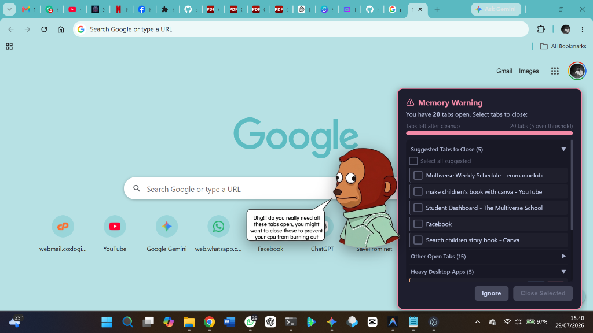
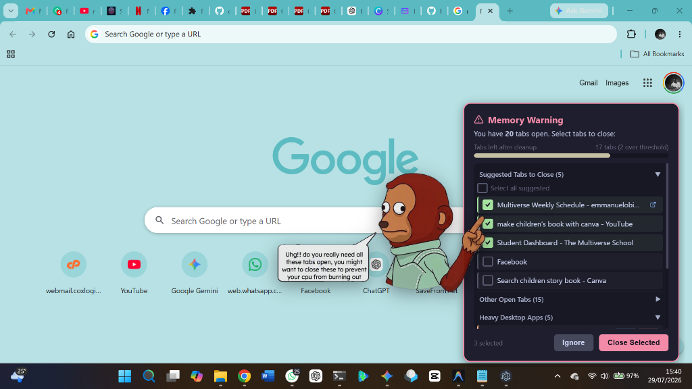
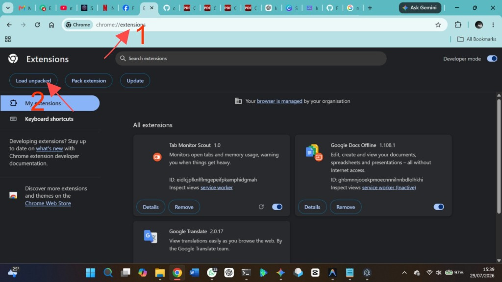

# 🐵 Tab Monitor

> **Smart Browser Tab & Memory Enforcer for Windows & Chrome**  
> A lightweight system tray application powered by **Tauri (Rust)** and a **Chrome Extension (Scout)** that dynamically warns you when your browser tab count exceeds safe memory thresholds.

---

## 🌟 Screenshots & Showcase

### 1. Live Tab Threshold Warning
When your open tab count exceeds your configured limit (default: 15 tabs), the animated avatar character floats seamlessly over your desktop to point out high-memory tabs for cleanup.



---

### 2. Interactive Tab Selection & Pointing Focus
The avatar dynamically adjusts pose while pointing at recommended inactive tabs to close. You can toggle individual tabs, select suggested groups, or focus active windows directly.



---

### 3. Target Reached & Clean State
Once tab cleanup brings your open tab count within safe limits, the avatar switches to a cheerful thumbs-up state!


---

### 4. Chrome Extension Manual Setup
In addition to automated background installation, Tab Monitor Scout can be loaded manually via Developer Mode in `chrome://extensions`.



---

## 🛠️ Key Features

- **🚀 Dual-Architecture System**:
  - **Chrome Extension (Scout)**: Monitors browser tab events, calculates least-recently-used tabs, and sends native events.
  - **Native Messaging Host (Rust)**: Handles secure IPC communication between Chrome and the Windows OS.
  - **Tauri Tray App (Rust/JS)**: Renders a frameless, transparent overlay window with smooth animations and zero glassy border artifacts.
- **🎯 Smart Tab Selection**: Intelligently recommends closing tabs that are inactive, unpinned, and not playing audio.
- **💻 Desktop Heavy Process Detection**: Scans Windows OS running processes for memory-intensive desktop apps.
- **🔒 Pinned Extension Security**: Uses a fixed RSA 2048 public key in `manifest.json` ensuring identical Extension IDs across any computer.
- **⚡ Automated 1-Click Installer**: Complete UAC self-elevating setup script that configures Chrome native messaging keys and desktop shortcuts.

---

## 📂 Project Structure

```
tab-monitor/
├── extension/             # Chrome Extension (Scout)
│   ├── background.js      # Tab tracker & Native Messaging client
│   ├── manifest.json      # MV3 extension manifest (Fixed RSA key)
│   ├── popup.html / js    # Extension action menu
│   └── options.html / js  # Tab threshold configuration settings
├── native-host/           # Rust Native Messaging Host
│   ├── src/main.rs        # Standard I/O byte-stream IPC host
│   └── manifest.json      # Windows Registry Native Messaging manifest
├── tray-app/              # Tauri System Tray Overlay App
│   ├── src/               # UI Overlay (HTML, CSS, JS)
│   │   ├── assets/        # Avatar character image assets
│   │   ├── index.html     # Overlay markup
│   │   └── main.js        # Tauri event listeners & progress bar math
│   └── src-tauri/         # Rust backend (Win32 window positioning & shadow controls)
├── installer/             # Distribution Packaging & Setup Scripts
│   ├── package.ps1        # Bundles release builds into TabMonitor-Setup
│   ├── install.ps1        # PowerShell UAC setup script
│   ├── install.bat        # 1-Click Installer launcher
│   ├── uninstall.ps1      # Complete system cleanup script
│   └── uninstall.bat      # 1-Click Uninstaller launcher
└── docs/images/           # Application screenshots & guides
```

---

## 📦 Installation Guide

### Option 1: 1-Click Automated Setup (Recommended)
1. Download or copy the **`TabMonitor-Setup`** folder.
2. Double-click **`Install Tab Monitor.bat`**.
3. Accept the Windows UAC Administrator prompt (**Yes**).
4. The installer will:
   - Copy binaries to `%LOCALAPPDATA%\TabMonitor`.
   - Register the Windows Native Messaging Host.
   - Inject `--load-extension` flags into Chrome shortcuts.
   - Add Tab Monitor Tray App to Windows Startup.
   - Relaunch Chrome automatically with Tab Monitor Scout enabled.

---

### Option 2: Manual Chrome Developer Mode Loading
If Chrome doesn't load the extension automatically:
1. Open `chrome://extensions` in Chrome.
2. Toggle **Developer mode** ON (top right corner).
3. Click **Load unpacked** (top left).
4. Select the folder: `%LOCALAPPDATA%\TabMonitor\extension` (or your local project `extension` directory).

---

## 🧹 Uninstallation

To completely remove Tab Monitor from any Windows PC:
1. Open the **`TabMonitor-Setup`** folder.
2. Double-click **`Uninstall Tab Monitor.bat`**.
3. Accept the Windows UAC Administrator prompt (**Yes**).

This automatically stops all running background processes, cleans up Windows Registry keys, restores Chrome desktop shortcuts, and removes all installation files.

---

## 🔧 Building from Source

### Prerequisites
- [Node.js](https://nodejs.org/) (v18+)
- [Rust & Cargo](https://rustup.rs/) (v1.75+)

### Building Release Package
To build release binaries and package the setup bundle:

```powershell
# Run packaging script from project root
powershell -File "installer/package.ps1"
```

The output distribution package will be assembled in `dist/TabMonitor-Setup`.

---

## 📄 License
MIT License. Built for seamless browser performance monitoring.
